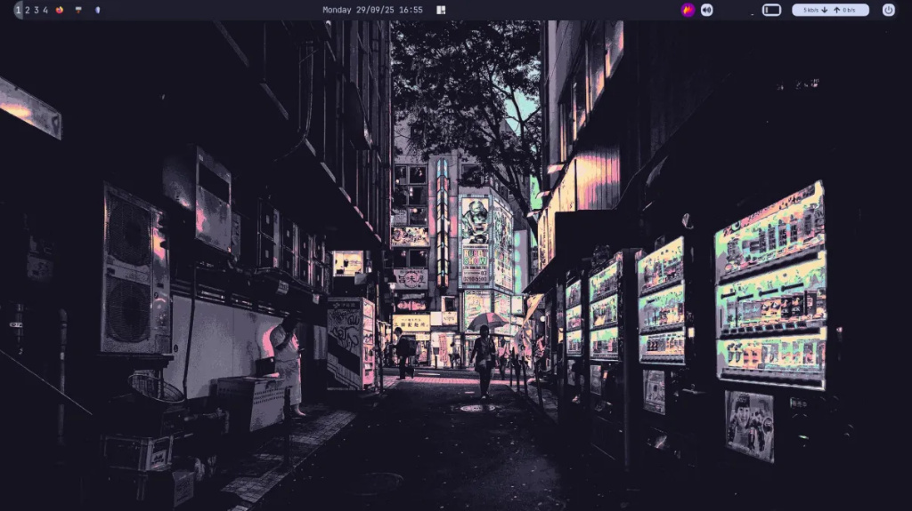
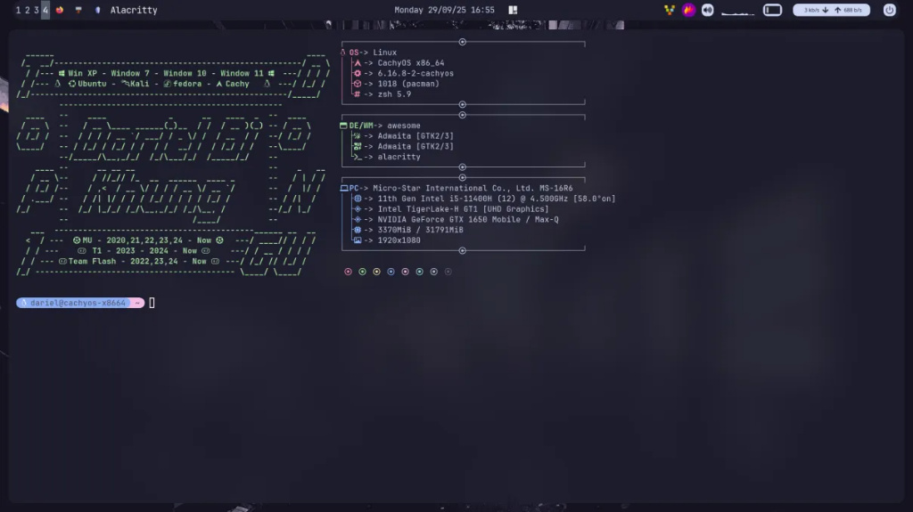

# awesomewm-dotfiles-stable

My personal Linux configuration files (`~/.config` and related home dotfiles), managed for a CachyOS/Arch-based setup running **AwesomeWM**.

This repository includes window manager config, terminal, file manager, wallpaper/lockscreen tools, theming, and system fetch tools.

## Table of Contents
- [Screenshots](#screenshots)
- [Requirements](#requirements)
- [Installation](#installation)
- [Directory Tree](#directory-tree)
- [Included Apps](#included-apps)
- [Tech Stack](#tech-stack)

## Screenshots

<table>
  <tr>
    <td></td>
    <td></td>
  </tr>
</table>

## Requirements
- Arch-based distro (Arch Linux, CachyOS, etc.)
- `git`
- An AUR helper (`yay` or `paru`) recommended for installing packages

## Installation

Step 1: Clone this repository.
```bash
git clone https://github.com/88kbleirad/dotfile_awesome.git
cd dotfile_awesome
```

Step 2: Back up your existing config.
```bash
mv ~/.config ~/.config.bak
```

Step 3: Copy or symlink the folders/files you need into `~/.config` and your home directory.
```bash
# Copy config folders
cp -r awesome alacritty rofi picom Thunar icons gtk-3.0 fastfetch neofetch nitrogen .icons .screenlayout ~/.config/

# Copy home dotfiles
cp .profile .zshenv .zshrc ~/
```

Step 4: Restart the relevant apps (e.g. restart AwesomeWM with `Alt + Shift + R`, reload your shell with `source ~/.zshrc`, etc).

## Directory Tree

```
.dotfiles_awesome/
    ├── .icons/
    ├── .screenlayout/
    ├── Pictures/
    ├── Thunar/
    ├── alacritty/
    ├── awesome/
    ├── fastfetch/
    ├── gtk-3.0/
    ├── icons/
    ├── neofetch/
    ├── nitrogen/
    ├── picom/
    ├── rofi/
    ├── .profile
    ├── .zshenv
    ├── .zshrc
    ├── rimuru-tempest.theme.css
    ├── system24.theme.css
    ├── theme.css
    └── transparent.css
```

## Included Apps

| Folder/File | Description |
|---|---|
| `.icons/` | Custom/user-installed icon themes |
| `.screenlayout/` | Saved multi-monitor layout scripts (usually via `xrandr`) |
| `Pictures/` | Wallpapers and images used across configs |
| `Thunar/` | File manager configuration |
| `alacritty/` | Terminal emulator configuration |
| `awesome/` | AwesomeWM window manager config — see [dotfile-awesome](https://github.com/88kbleirad/dotfile_awesome.git) |
| `fastfetch/` | System info fetch tool config |
| `gtk-3.0/` | GTK3 theming settings |
| `icons/` | Additional icon theme assets |
| `neofetch/` | System info fetch tool config (legacy, kept for reference) |
| `nitrogen/` | Wallpaper manager configuration |
| `picom/` | Compositor config (transparency, shadows, animations) |
| `rofi/` | Application launcher / menu configuration |
| `.profile` | Shell login environment variables |
| `.zshenv` | Zsh environment variables (loaded on every shell) |
| `.zshrc` | Zsh interactive shell configuration |
| `rimuru-tempest.theme.css` | Custom GTK/theme file (Rimuru Tempest color scheme) |
| `system24.theme.css` | Custom GTK/theme file (System24 color scheme) |
| `theme.css` | Base/default theme file |
| `transparent.css` | Transparency overrides for supported apps |

## Tech Stack
- **Window Manager:** AwesomeWM (Lua)
- **Terminal:** Alacritty
- **Compositor:** Picom
- **Launcher:** Rofi
- **File Manager:** Thunar
- **Wallpaper:** Nitrogen
- **System Info:** Fastfetch / Neofetch
- **Shell:** Zsh
- **Styling:** GTK3, CSS-based theming


